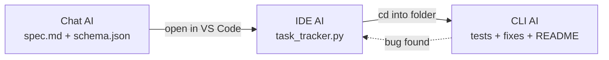
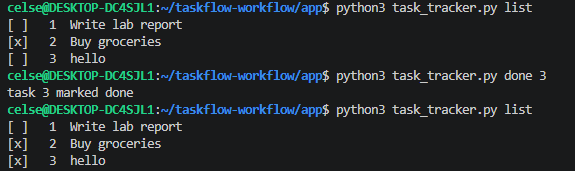

# Multi-Stage AI Workflow Across UX Types

## Overview

This workflow builds TaskFlow, a small command-line task tracker, by
passing a single line of work through three AI tools of three different
UX types: a chat interface, an IDE assistant, and a CLI agent. Each
stage's output is the next stage's only input. A chat-based AI produces
the specification, an IDE-based AI implements it, and a CLI-based AI
tests, debugs, and documents the result. Nothing in the chain is
regenerated from scratch, and nothing is written by hand outside the
three stages.

## Workflow diagram



The dashed edge represents feedback, not a repeated run: when the CLI
stage finds a defect, the correction is written back into the same
`task_tracker.py` the IDE stage produced, rather than starting a new
implementation.

## Process

**Stage 1 — chat.** A chat-based AI is given a single prompt asking for a
specification and a JSON Schema for TaskFlow: its commands, its data
model, its non-functional constraints, and a set of acceptance criteria.
The chat stage has no filesystem or execution context, so it is deliberately
asked for structure and intent rather than code. Its output is captured
as `spec.md` and `schema.json`.

**Stage 2 — IDE.** The spec and schema are placed in a project folder
opened in VS Code. The Claude extension reads both files and produces
`task_tracker.py`, along with a `tasks.json` pre-populated with the
spec's sample data. This is where the specification's open decisions get
resolved — how ids are assigned, what an error message looks like on
invalid input — because the IDE stage has the filesystem context and
editor review that the chat stage lacked.

**Stage 3 — CLI.** Claude Code is run against the same project folder.
It writes a pytest suite covering the tracker's commands, executes it,
and corrects any defect it finds in `task_tracker.py` before writing a
usage `README.md`. This stage exists because it is the only one able to
actually run the code rather than reason about it — a class of bug that
only appears at execution time is only catchable here.

Two manual actions connect the three stages: moving `spec.md` and
`schema.json` into the project folder before stage 2, and opening a
terminal in that same folder before stage 3. Both are file or directory
operations, not rewrites of any content.

## Prompts used at each stage

**Stage 1 (chat):** "I need a spec for a small CLI task tracker called
TaskFlow. Cover: (1) commands the CLI supports (add/list/done/delete or
similar), what each does, and how data persists between runs; (2) a data
model for a single task with a JSON Schema; (3) non-functional
requirements — language/runtime, dependency constraints, error handling;
(4) sample data to test with; (5) an acceptance checklist. Output as
Markdown with headings, plus the JSON Schema as a separate fenced code
block. Don't write any implementation code — just the spec."

**Stage 2 (IDE):** "Read spec.md and schema.json in this folder.
Implement task_tracker.py exactly per the spec: pure Python 3 stdlib,
CRUD commands (add/list/done/delete), JSON persistence in tasks.json,
graceful error handling on invalid input. Also create tasks.json
pre-populated with the sample data from the spec."

**Stage 3 (CLI):** "Write pytest tests for task_tracker.py covering
add/list/done/delete and the missing-tasks.json case. Run them, fix any
bugs you find, then write a short README.md explaining usage."

## Why chat → IDE → CLI

A chat AI generates structured intent quickly but cannot produce
anything directly runnable, since it has no filesystem or execution
environment in this setup. An IDE AI has both a working folder and an
editor, which suits a first-pass implementation that benefits from being
reviewed before it is tested. A CLI AI has a shell, so it is the only
stage that can execute what the IDE stage wrote and catch a defect that
only surfaces at runtime. Each stage is assigned the part of the problem
it is actually equipped to do, and every handoff between them is a plain
file — a spec, a schema, a `.py` file — rather than an API call, so the
stages have no dependency on one another beyond the file itself.

## Adaptability

No stage depends on a specific vendor. Stage 1 requires only a chat AI
capable of following instructions and producing Markdown — ChatGPT,
Gemini Chat, Claude.ai, or a local model all satisfy this. Stage 2
requires only an IDE assistant with read/write access to an open folder
— the Claude extension, Copilot Chat, and Cursor are interchangeable
here. Stage 3 requires only a CLI agent with shell and file access —
Claude Code, Aider, and Gemini CLI all qualify. Because every handoff
format is plain text, replacing any one tool requires no change to the
other two stages.

## Efficiency

Building a CLI tool as a single undifferentiated task typically means
one person handles design, implementation, and testing in sequence, and
discovers defects only after manually exercising the tool by hand. This
workflow separates those concerns by capability: the chat stage covers
design in a single round-trip; the IDE stage covers implementation with
an editor to review the result before it runs; the CLI stage covers
verification by actually executing the code, correcting what it finds
rather than merely reporting it. The only manual effort involved is
moving files and opening a terminal.

## Verification

The following commands confirm the implementation matches the spec:

```bash
python3 -m pytest test_task_tracker.py -v
python3 task_tracker.py add "Test task"
python3 task_tracker.py list
python3 task_tracker.py done 1
python3 task_tracker.py delete 1
```

Confirmed:
- All pytest cases pass
- `add` creates a task and prints its id
- `list` shows all tasks, with completed ones visibly marked
- `done <id>` updates status correctly
- `delete <id>` removes the task
- Restarting and re-running `list` still reflects prior state, confirming
  persistence

### Rendered output

