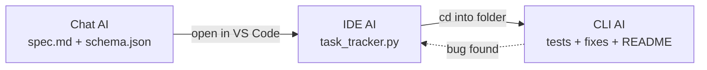

# Multi-Stage AI Workflow Across UX Types

A chat-based AI drafts a spec for a small CLI task tracker; an IDE-based
AI (VS Code + the Claude extension) turns that spec into working code;
a CLI-based AI (Claude Code) tests it, fixes what's broken, and writes
the docs. The output of each stage is the literal input to the next —
nothing gets regenerated from scratch, and nothing is hand-written
outside the three AI stages.

## Workflow diagram



The dashed arrow isn't a literal re-run of stage 2 — it's there because
if the CLI stage finds a bug, the fix goes into the same
`task_tracker.py` the IDE stage wrote. That's the one place this workflow
loops back on itself.

## Step-by-step

1. **Brief.** Decide what you want built — here, a task tracker you run
   from the terminal. No design decisions yet.
2. **Chat stage.** Paste [`01-chat-stage/prompt.md`](01-chat-stage/prompt.md)
   into any chat-based AI. It comes back with a spec and a JSON Schema for
   the data. Raw output is captured at
   [`01-chat-stage/spec.md`](01-chat-stage/spec.md) and
   [`01-chat-stage/schema.json`](01-chat-stage/schema.json).
3. **Handoff.** Copy both files into a new folder and open it in VS Code.
   This is one of only two manual steps in the whole workflow — moving
   files, not rewriting them.
4. **IDE stage.** Paste [`02-ide-stage/prompt.md`](02-ide-stage/prompt.md)
   into the Claude extension. It reads the spec and schema and writes
   `task_tracker.py` plus a pre-populated `tasks.json` straight into the
   open folder. Whatever the spec left open — how ids get assigned, the
   exact wording of an error — gets decided here, and it's worth writing
   down why in
   [`02-ide-stage/implementation-notes.md`](02-ide-stage/implementation-notes.md).
5. **Handoff.** `cd` into that same folder and start a Claude Code
   session there. Second and last manual step.
6. **CLI stage.** Paste [`03-cli-stage/prompt.md`](03-cli-stage/prompt.md).
   The CLI AI writes tests, runs them, fixes whatever breaks in
   `task_tracker.py`, and writes a usage README. Notes on what it found
   go in
   [`03-cli-stage/implementation-notes.md`](03-cli-stage/implementation-notes.md).
7. **Verification.** Run the test suite and try the CLI by hand — see the
   log below.

## Why chat → IDE → CLI specifically

- A chat AI has no filesystem or code-execution access in this setup —
  it's good at turning a rough idea into structured intent fast, bad at
  producing anything you can actually run.
- An IDE AI has a folder to work in and an editor to review its own diffs
  in, which makes it the right place for a first-pass implementation a
  human can skim before it gets tested.
- A CLI AI has a shell, so it can run what the IDE stage wrote and catch
  the kind of bug that only shows up when the code actually executes —
  something neither earlier stage can do just by reading.
- Chaining all three means each one is doing the part of the job it's
  actually good at, and every handoff is a plain file — a spec, a schema,
  a `.py` — never an API call between the tools. The stages don't need to
  know about each other.

## Adaptability

Nothing here is tied to a specific vendor:

- Stage 1 only assumes a chat AI that can follow instructions and write
  Markdown — ChatGPT, Gemini Chat, Claude.ai, or a local model all work
  as-is.
- Stage 2 only assumes an IDE AI with read/write access to an open
  folder — the Claude extension, Copilot Chat, Cursor, any of them.
- Stage 3 only assumes a CLI AI with shell and file access — Claude Code,
  Aider, Gemini CLI.
- Every handoff format is plain text, so swapping out any one tool means
  zero changes to the other two stages.

## Efficiency

Building something like this alone usually means doing the design, the
implementation, and the testing serially, and finding out about bugs
only after you've been running commands by hand for a while. Splitting
it across three stages changes that:

- The spec and data model — the part that benefits from fast, broad
  generation — comes out of one prompt round-trip with the chat stage.
- The implementation — the part that benefits from being reviewed, not
  just generated — comes from the IDE stage, where you can actually see
  the diff before anything runs.
- The debugging — the part that benefits from execution, not
  description — comes from the CLI stage, which fixes what it finds
  instead of just reporting it.
- The two manual steps are both "move some files and open a terminal,"
  not a rewrite of anything.

## Verification log

Run from the folder holding `task_tracker.py`:

```bash
python3 -m pytest test_task_tracker.py -v
python3 task_tracker.py add "Test task"
python3 task_tracker.py list
python3 task_tracker.py done 1
python3 task_tracker.py delete 1
```

Checked:
- [ ] All pytest cases pass
- [ ] `add` creates a task and prints its id
- [ ] `list` shows all tasks, done ones visibly marked
- [ ] `done <id>` flips status to done
- [ ] `delete <id>` removes the task
- [ ] Restarting and re-running `list` still shows prior tasks
      (persistence actually works)

### Rendered output

(paste a terminal transcript or screenshot here once you've run it)